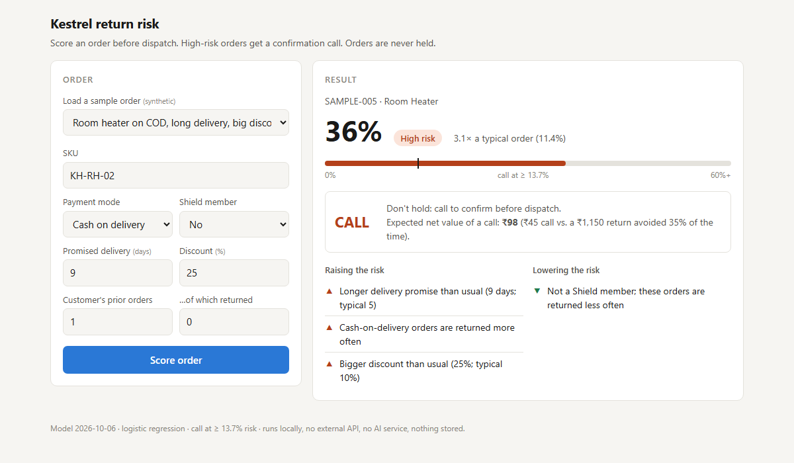

# Kestrel Home: pre-dispatch returns risk

Scores each order **before dispatch** for its chance of being returned, and recommends one of two actions:
**CALL** (a ₹45 confirmation call) for the riskiest ~25% of orders, or **SHIP** as normal. **Orders are never held.**
Runs entirely on your own machine: no API key, no external service, no AI model inside the product, ₹0 per prediction.



## Results at a glance

| | |
|---|---|
| Model | Logistic regression on 9 fields known at dispatch (promised delivery days, the customer's prior orders and returns, discount, Shield, payment mode, product family) |
| How it was tested | Time-based: three walk-forward quarters (train on the past, score the next quarter) plus a final quarter kept aside and scored only once |
| Ranking quality (ROC-AUC) on unseen quarters | **0.800 / 0.770 / 0.766**, holdout **0.787** → expected on the test file: **0.77–0.80** |
| Of the orders it says to call | **27 in 100** would otherwise be returned (vs 11 in 100 overall); they hold **61%** of all returns |
| Rupees (at ~700 orders/month, ₹1,150 per return) | Calling the riskiest 25% **saves ~₹11,400/month**; holding the riskiest 10% (the original plan) **loses ~₹10,400/month** |
| How often it's wrong | ~3 in 4 calls reach customers who'd have kept the order (fine at ₹45); ~4 in 10 returns aren't flagged |

**Deliverables**

| What | Where |
|---|---|
| Predictions for `test_unlabelled.csv` | `outputs/predictions.csv`: **not in this repository** (it contains Kestrel's order IDs); shared separately with the submission. Its checks and SHA-256 fingerprint are in [`evidence/predictions_check.md`](evidence/predictions_check.md) |
| Working service: one endpoint + one screen | `app/` (run it with the steps below) |
| Evidence that it works, and how often it doesn't | [`evidence/backtest_report.md`](evidence/backtest_report.md) (start here), [`evidence/scenario_tests.md`](evidence/scenario_tests.md), [`evidence/clean_machine_test.md`](evidence/clean_machine_test.md), `notebooks/` |
| One-page memo to Ritu | [`memo.pdf`](memo.pdf) |
| Every decision and the rules behind it | [`key_findings.md`](key_findings.md) (phase by phase: results → decision → alternatives), [`policy.md`](policy.md) (data, leakage, cost and decision rules), [`plan.md`](plan.md) |

---

## 1. Run it (about 3 minutes)

**Needs Python 3.12 or 3.13** (the pinned numpy 2.5 / scipy 1.18 don't support older versions). Tested on Windows 11 with Python 3.12 and 3.13; the macOS/Linux commands are standard but weren't tested. Run every command **from the repository folder**. The data pack is **not** needed to run the service.

### Windows (PowerShell)

```
py -3.12 -m venv .venv
.venv\Scripts\python -m pip install -r requirements.txt
.venv\Scripts\python -m uvicorn app.main:app --port 8000
```

If `py -3.12` isn't found, use `py -3.13`, or any Python 3.12/3.13 as `python -m venv .venv`. Calling `.venv\Scripts\python` directly means you never need to "activate" the environment.

### macOS / Linux

```
python3 -m venv .venv
source .venv/bin/activate
pip install -r requirements.txt
uvicorn app.main:app --port 8000
```

**You should see** `Uvicorn running on http://127.0.0.1:8000`. Leave that window open, and stop the server with **Ctrl+C** when you're done. The install takes about 2 minutes on a fresh machine (no compiler needed).

---

## 2. Use the screen

Open **http://localhost:8000**. Pick a sample order from the dropdown (all are made up), or type your own, and press **Score order**. You'll see the return risk, a Low / Medium / High band, how it compares with a typical order, **CALL or SHIP**, the expected value of a call in ₹, and the reasons behind the score.

**Things to try:**

| Try | What you should see |
|---|---|
| http://localhost:8000/?sample=1 (repeat returner, COD, robot vacuum) | **84.5%, High, CALL**; reasons: past returns, robot vacuum, cash on delivery |
| http://localhost:8000/?sample=2 (first order, UPI, ceiling fan) | **1.1%, Low, SHIP** |
| http://localhost:8000/?sample=8 (just below the cutoff) | **12.9%, Medium, SHIP**: "A call would roughly break even; below the call cutoff, so ship." |
| Sample 8, then change **Promised delivery** to **60** | Scored as 12 days (the most the model has seen), with a yellow **"Check these inputs"** warning |
| http://localhost:8000/?sample=6 / ?sample=7 | Shield status unknown / SKU not in the catalogue: still scored, with a **"Scored with less information"** notice |

---

## 3. Use the API

Interactive docs (try requests in the browser): **http://localhost:8000/docs** → `POST /score` → *Try it out*.

`POST /score` takes one order as JSON. Only these fields are used:

| Field | Required | Values |
|---|---|---|
| `sku` | yes | Kestrel SKU, e.g. `KH-AF-01` (case and spaces don't matter) |
| `payment_mode` | no | `cod`, `emi`, `prepaid_card`, `prepaid_upi`, `unknown` |
| `promised_delivery_days` | yes | whole number, 1–60 |
| `discount_pct` | yes | 0–100 |
| `customer_prior_orders` | yes | whole number ≥ 0 |
| `customer_prior_returns` | yes | whole number, not more than prior orders |
| `shield_member` | no | `Y`, `N`, `unknown` |
| `order_id` | no | echoed back |

**Windows (PowerShell):**
```
$body = '{"order_id":"SAMPLE-001","sku":"KH-RV-02","payment_mode":"cod","promised_delivery_days":8,"discount_pct":18,"customer_prior_orders":3,"customer_prior_returns":1,"shield_member":"Y"}'
Invoke-RestMethod -Method Post -Uri http://localhost:8000/score -ContentType "application/json" -Body $body
```

**macOS / Linux:**
```
curl -X POST http://localhost:8000/score -H "Content-Type: application/json" \
  -d '{"order_id":"SAMPLE-001","sku":"KH-RV-02","payment_mode":"cod","promised_delivery_days":8,"discount_pct":18,"customer_prior_orders":3,"customer_prior_returns":1,"shield_member":"Y"}'
```

**Response:**
```json
{
  "order_id": "SAMPLE-001",
  "return_probability": 0.8447,
  "risk_band": "High",
  "vs_typical": "7.4× a typical order (11.4%)",
  "recommended_action": "CALL",
  "note": "Don't hold: call to confirm before dispatch.",
  "call_value_inr": 295.0,
  "reasons_raising": [
    "Customer has returned 1 of 3 previous orders",
    "Robot vacuums are returned more often than most products",
    "Cash-on-delivery orders are returned more often"
  ],
  "reasons_lowering": [],
  "fallbacks_used": [],
  "warnings": [],
  "family": "Robot Vacuum",
  "model_version": "2026-10-06",
  "ignored_fields": []
}
```

**Risk bands:** Low < 7% · Medium 7–13.7% · **High ≥ 13.7% = CALL** (the riskiest ~25% of orders).

**How it handles awkward input:**
- **Missing or invalid required field** → HTTP 422 naming the field. **Typo in a category** (e.g. `"upi"`) → 422 listing the allowed values.
- **Shield status or payment mode missing / `"unknown"`, or an unknown SKU** → still scored, using the training average for that field, and listed in `fallbacks_used`.
- **Values outside what the model was trained on** (more than 12 delivery days, discount over 60%, more than 10 prior orders or 6 prior returns) → scored at the edge of that range, with a warning in `warnings`.
- **Any other field** (delivery notes, pincode, post-dispatch columns…) → ignored and listed by name in `ignored_fields`; values are never echoed back.
- The service doesn't log or store request bodies. `GET /health` shows the model version, the call cutoff and the validation scores.

---

## 4. Check, retrain and reproduce

**Run the tests** (works without the data pack; the 10 tests that need it, or the predictions file, are skipped):
```
.venv\Scripts\python -m pytest          # Windows
python -m pytest                         # macOS / Linux (with the venv active)
```
154 tests cover data cleaning, the leakage guard, features, the model, the rupee economics, the API, the 47-case scenario sheet, and the predictions file.

**Retrain and re-score** (needs the data pack): put `train.csv`, `test_unlabelled.csv`, `customers.csv`, `products.csv` and `sample_submission.csv` in a `data/` folder, then:
```
python -m kestrel.train      # rebuilds models/model.joblib + model_meta.json (identical model)
python -m kestrel.predict    # writes outputs/predictions.csv + evidence/predictions_check.md
```
(On Windows, prefix with `.venv\Scripts\`, e.g. `.venv\Scripts\python -m kestrel.train`.)

**Verify the predictions file.** `kestrel.predict` records the file's SHA-256 in `evidence/predictions_check.md`. The same value means the file is byte-for-byte the one that was checked; opening and re-saving it in Excel changes it.
```
Get-FileHash outputs\predictions.csv -Algorithm SHA256      # Windows
shasum -a 256 outputs/predictions.csv                        # macOS
sha256sum outputs/predictions.csv                            # Linux
```

**Notebooks** (the full analysis, read in order): `pip install -r requirements-dev.txt` adds Jupyter and matplotlib. Order: 01 data audit → 02 exploration → 03 model selection → **03b one-time holdout (read it, don't re-run it)** → 04 rupee economics → 05 error analysis. On Windows, JupyterLab may need [long-path support](https://pip.pypa.io/warnings/enable-long-paths) if the project sits in a deep folder; the service doesn't.

---

## Troubleshooting

| Problem | Fix |
|---|---|
| The page shows old behaviour after an update | The server doesn't reload by itself: Ctrl+C, start it again, then **Ctrl+F5** in the browser. For development, add `--reload` to the start command |
| `address already in use` / port 8000 busy | Another server is running: stop it, or use `--port 8001` and open http://localhost:8001 |
| `curl` errors in Windows PowerShell | PowerShell's `curl` is a different command: use `Invoke-RestMethod` (above) or `curl.exe` |
| `No matching distribution found for numpy==2.5.3` | Your Python is older than 3.12: create the venv with Python 3.12 or 3.13 |
| Started with a different Python (e.g. Anaconda) | Always start it with the venv's Python as shown, so the pinned library versions the model was saved with are used |

---

## What's inside

```
app/            the service (main.py), the screen (static/index.html), synthetic sample orders (samples.json)
src/kestrel/    data cleaning, features, model, training, rupee economics, reasons, scoring service, predictions
models/         model.joblib (4.6 KB logistic regression) + model_meta.json (settings, metrics, product catalogue, decision rule)
notebooks/      the analysis, phase by phase
evidence/       backtest report, scenario tests, clean-machine test, predictions check, figures
tests/          154 tests
memo.pdf        one-page memo to Ritu
```

**Data handling (Kestrel ops-policy §10):** the raw data pack, `predictions.csv` and every file with order rows are kept out of this repository. The service, screen and sample orders contain no customer data; the samples are made up.
